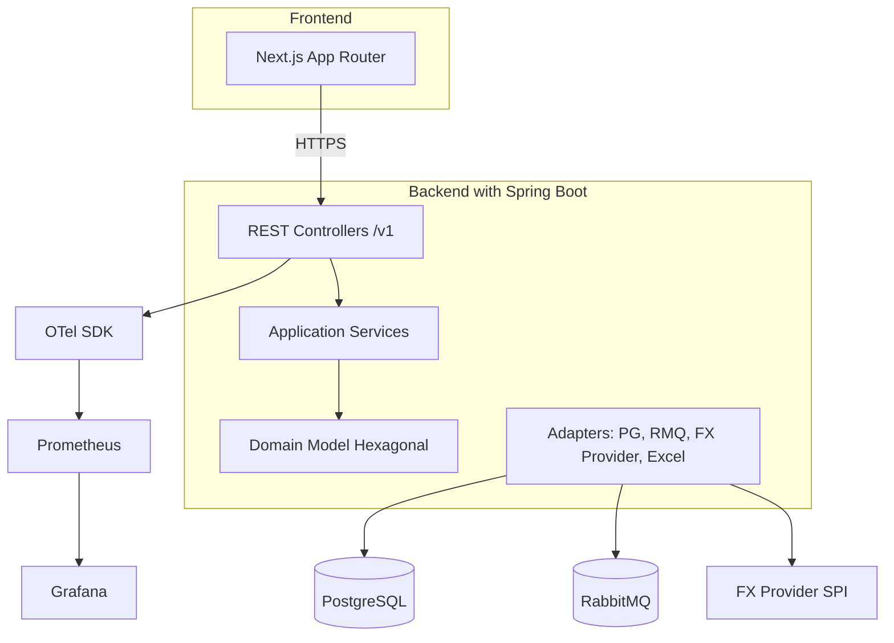

# C4 — Containers

```mermaid

flowchart TB
  subgraph Frontend
    FE[Next.js App Router]
  end
  subgraph Backend with Spring Boot
    APIv1[REST Controllers /v1]
    App[Application Services]
    Domain[Domain Model Hexagonal]
    Adapters[Adapters: PG, RMQ, FX Provider, Excel]
  end
  FE -->|HTTPS| APIv1
  APIv1 --> App --> Domain
  Adapters --> PG[(PostgreSQL)]
  Adapters --> RMQ[(RabbitMQ)]
  Adapters --> FX[FX Provider SPI]
  APIv1 --> OTel[OTel SDK] --> Prom[Prometheus] --> Graf[Grafana]

```
